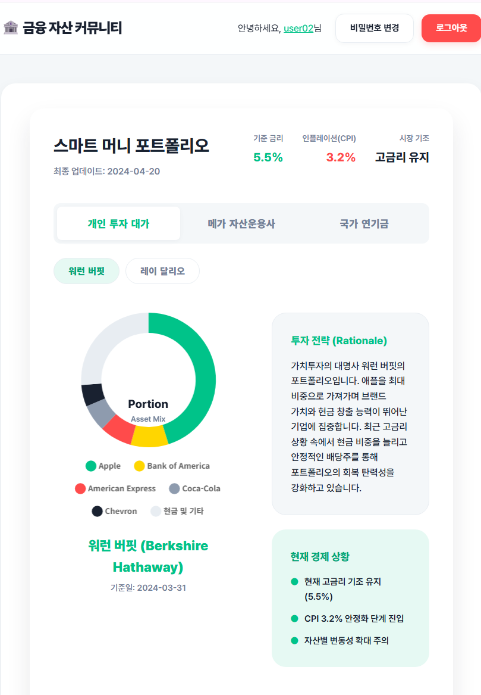
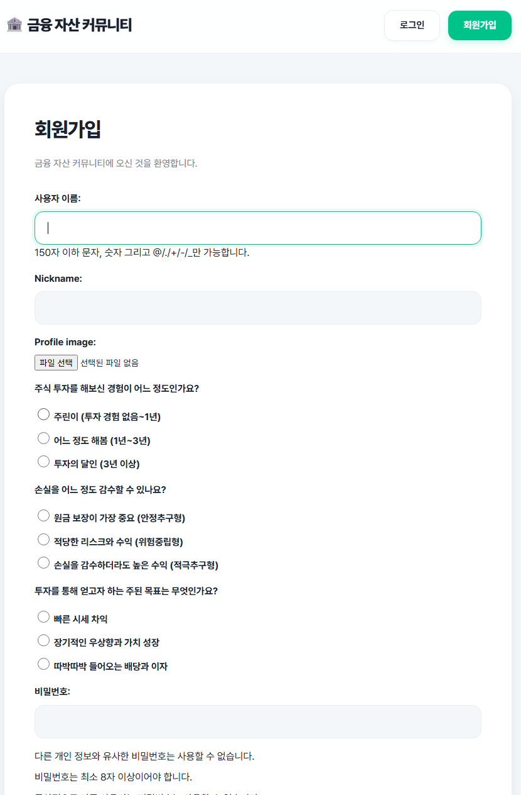
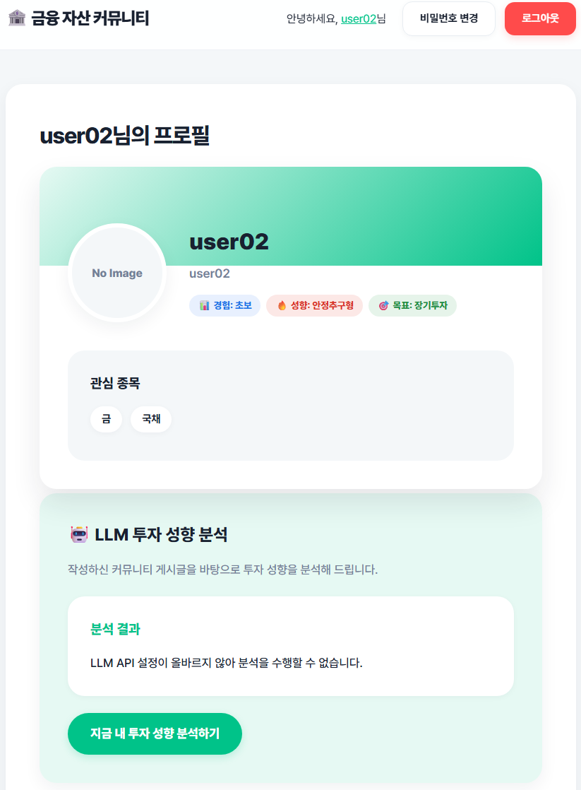
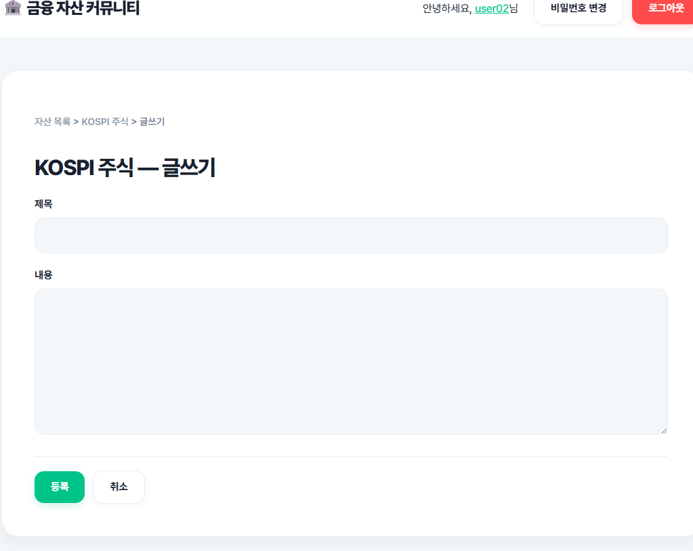

# 🚀 금융 자산 정보 토론 커뮤니티 (pjt05_v2)

본 프로젝트는 Django 기반의 금융 자산 커뮤니티로, 사용자 인증, 포트폴리오 대시보드, 그리고 **LLM(대규모 언어 모델) 기반의 부적절 컨텐츠 필터링 및 투자 성향 분석** 기능을 포함하는 고도화된 웹 애플리케이션입니다.

---

## 1. 📸 웹 화면 스크린샷


- **메인 화면 (포트폴리오 대시보드)**
  
- **회원가입 (설문조사 포함)**
  
- **사용자 프로필 (투자 성향 분석)**
  
- **자산별 토론 게시판**
  

---

## 2. 📁 디렉토리 구조

```text
pjt05_v2/
├── accounts/               # 사용자 인증 및 프로필 관리 앱
│   ├── templates/accounts/
│   │   ├── login.html
│   │   ├── profile.html
│   │   ├── signup.html
│   │   └── password_change.html
│   ├── forms.py            # 회원가입 설문조사 커스텀 폼
│   ├── models.py           # Custom User 모델 (투자성향 필드 포함)
│   ├── urls.py
│   └── views.py
├── community/              # 커뮤니티 게시판 및 포트폴리오 앱
│   ├── templates/community/
│   │   ├── asset_list.html # 메인 화면 (포트폴리오 대시보드)
│   │   ├── base.html       # 관통 템플릿 (Mohaet 스타일 적용)
│   │   ├── board.html
│   │   ├── post_detail.html
│   │   └── post_form.html
│   ├── llm.py              # LLM 통신 (필터링, 성향 분석, 콜드스타트 로직)
│   ├── models.py
│   ├── urls.py
│   ├── utils.py            # JSON 데이터 파싱 유틸
│   └── views.py
├── config/                 # 프로젝트 메인 설정 (settings.py 등)
├── data/
│   ├── assets.json         # 기본 자산 목록 데이터
│   └── smart_money.json    # 포트폴리오 대시보드 데이터 (워런버핏 등)
├── 화면사진/               # README 스크린샷용 이미지 폴더
└── README.md
```

---

## 3. 💡 구현 기능 설명

### 🔐 사용자 인증 및 프로필 (Custom User)
- **커스텀 유저 모델**: 기본 인증 모델을 확장하여 `nickname`, `interest_stocks`, `profile_image` 및 **투자 성향 설문 데이터**(경험, 위험 감수 성향, 투자 목표)를 저장합니다.
- **회원가입 설문조사**: 가입 시 객관식 설문을 진행하여, 사용자의 초기 투자 성향 데이터를 확보합니다.

### 🤖 LLM 기반 커뮤니티 지능화 (OpenAI/Upstage)
- **실시간 욕설/비방 필터링**: 게시글과 댓글 작성 시 LLM이 문맥을 파악하여 부적절한 언행(우회 표현 포함)을 자동 차단합니다.
- **투자 성향 입체 분석 (콜드스타트 극복)**:
  - **Cold Start (게시글 0개)**: 게시글이 없는 신규 유저라도, 회원가입 시 응답한 **설문조사 데이터만으로 초기 투자 가이드와 포트폴리오를 제안**합니다.
  - **게시글 작성 후**: 유저가 실제로 작성한 "게시글 성향"과 "가입 시 응답한 설문 목표"를 **교차 검증 및 대조**하여("안정추구형이라고 하셨지만 실제론 변동성에 관심이 많으시네요" 등) 아주 예리하고 입체적인 분석을 제공합니다.

### 📈 스마트 머니 포트폴리오 대시보드 (메인 화면)
- **Chart.js 도넛 차트**: 워런 버핏, 국민연금 등 대가들의 포트폴리오 비중을 아름다운 시각화로 제공합니다.
- **비동기 토론 피드 (AJAX)**: 각 포트폴리오 전략에 대해 새로고침 없이 즉각적으로 의견을 남기고 소통할 수 있습니다.
- **Mohaet 디자인 시스템**: 모햇 사이트를 모티브로 한 부드러운 파스텔톤, 라운드 코너(Pill 버튼), 카드 UI를 전역적으로 적용하여 매우 세련된 사용자 경험을 제공합니다.

### 📋 자산별 토론 게시판 (게시글 및 댓글 CRUD)
- 로그인한 사용자만 작성 가능하며, 본인이 쓴 글/댓글만 수정 및 삭제가 가능하도록 권한 제어가 철저히 구현되어 있습니다.

---

## 4. 📚 학습 내용

- **Django Model & Form 확장**: `AbstractUser`를 상속받아 커스텀 유저 모델을 구축하고, `UserCreationForm`을 오버라이딩하여 라디오 버튼 형태의 설문조사 필드를 추가하는 방법을 학습했습니다.
- **LLM Prompt Engineering**: 프롬프트에 사용자의 "설문 데이터"와 "실제 텍스트 데이터"를 동시에 주입하여, LLM이 단순 요약이 아닌 **대조와 추론**을 하도록 유도하는 기법을 익혔습니다.
- **AJAX & 비동기 처리**: `fetch` API와 Django의 `JsonResponse`를 연동하여 화면 새로고침 없는 실시간 댓글 등록/조회(SPA 경험)를 구현했습니다.
- **프론트엔드 디자인 시스템화**: `:root` CSS 변수를 활용해 전역 컬러 파레트와 라운딩(radius)을 통일성 있게 관리하는 방법을 실습했습니다.

---

## 5. 🤔 느낀 점

### 김초아

이번 프로젝트(pjt05_v2)에서는 LLM을 활용한 '투자 성향 분석' 기능을 구현하면서, 사용자가 가입 직후 작성한 글이 하나도 없다면 어떻게 분석을 제공할 수 있을지. 즉, 콜드스타트(Cold Start) 문제에 대해 고민했습니다.
그결과, 단순히 에러 메시지를 띄우는 것이 아니라, 회원가입 단계에서부터 사용자의 투자 경험과 목표를 묻는 '성향 설문'을 받는 방향으로 데이터베이스 모델과 회원가입 폼 설계를 수정해보았습니다. 사용자가 나중에 글을 작성하게 되면 설문 응답(본인이 생각하는 성향)과 실제 게시글(실제 활동 내역)을 LLM이 교차 검증하게 함으로써, 훨씬 더 입체적이고 날카로운 분석 결과를 도출해낼 수 있을 것이라고 기대하고 있습니다.
이 과정을 통해, 단순한 기능 구현(API 연동)을 넘어서 어떤 데이터를 어떻게 수집해서 사용자에게 최고의 경험(UX)을 제공할 것인가를 고민하는 종합적인 아키텍처 설계의 중요성 배울 수 있었습니다.

### 서민경
금융 자산 커뮤니티 라는 도메인에 맞춰 Django의 기본 유저 모델을 커스텀하고, 회원가입부터 권한 관리까지 인증 흐름을 직접 구현 해 본 의미 있는 프로젝트였습니다.
특히 기업의 재무 상태나 투자의 타당성(viability)을 분석할 때 데이터의 신뢰성과 보안이 얼마나 중요한지 잘 알고 있었기에, 이번 프로젝트에서 유저의 비밀번호를 안전하게 관리하고 본인의 게시글만 수정/삭제하도록 권한을 제어하는 로직 을 짤 때 더욱 책임감을 갖고 임할 수 있었습니다.
